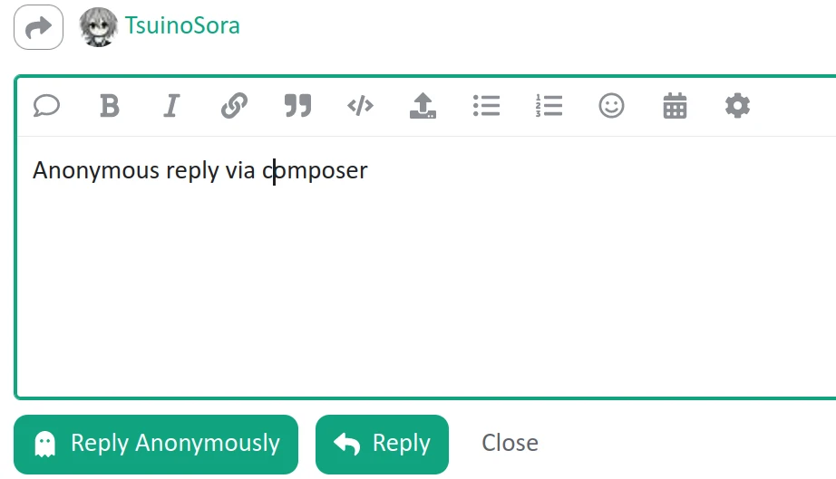

# discourse-anonymous-post

A Discourse plugin for posting as anonymous user via a button in composer, without the need to switch to anonymous mode.

## Current functionality and plan
* currently only support reply, plan to support 'create new topic anonymously'
* currently all users share **one** anonymous account, plan to support 'different identity for each user'
* plan: rate limit (by IP / user)
* plan: add configuration to limit anonymous posting to certain categories 

## Acknowledgements
Greatly inspired and helped by 
[communiteq/discourse-anonymous-categories](https://github.com/communiteq/discourse-anonymous-categories)
and 
[muhlisbc/discourse-scheduled-reply-plugin](https://github.com/muhlisbc/discourse-scheduled-reply-plugin). 
Thanks go to their authors :heart:.
